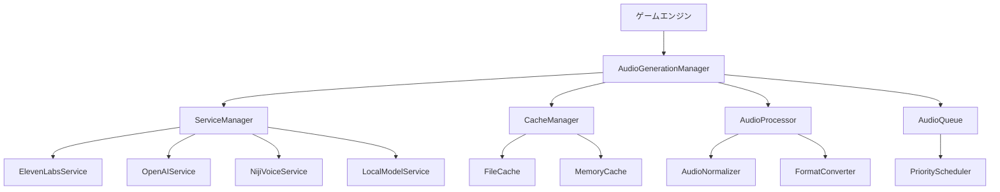

# 設計書

## 概要

AI音声生成システムは、ビジュアルノベルゲームに統合された音声生成機能を提供します。効果音、背景音楽、キャラクター音声合成を自動生成し、ゲーム体験を向上させます。システムは複数のAIサービスプロバイダーをサポートし、キャッシュ機能とフォールバック機能を備えています。

## アーキテクチャ

### システム構成



### レイヤー構造

1. **プレゼンテーション層**: ゲームエンジンとの統合インターフェース
2. **ビジネスロジック層**: 音声生成の制御とオーケストレーション
3. **サービス層**: 外部AIサービスとの通信
4. **データ層**: キャッシュとファイル管理

## コンポーネントとインターフェース

### AudioGenerationManager

メインの音声生成管理クラス。全ての音声生成リクエストを調整します。

```typescript
interface AudioGenerationManager {
  generateSoundEffect(context: GameEventContext): Promise<AudioBuffer>;
  generateBackgroundMusic(sceneContext: SceneContext): Promise<AudioBuffer>;
  generateCharacterVoice(dialogue: DialogueContext): Promise<AudioBuffer>;
  configure(config: AudioGenerationConfig): void;
  getStatus(): AudioGenerationStatus;
}
```

### ServiceManager

複数のAIサービスプロバイダーを管理し、フォールバック機能を提供します。

```typescript
interface ServiceManager {
  registerService(service: AudioGenerationService): void;
  generateAudio(request: AudioRequest): Promise<AudioBuffer>;
  getAvailableServices(): AudioGenerationService[];
  setServicePriority(priorities: ServicePriority[]): void;
}
```

### AudioGenerationService

各AIサービスプロバイダーの共通インターフェース。

```typescript
interface AudioGenerationService {
  name: string;
  isAvailable(): Promise<boolean>;
  generateAudio(request: AudioRequest): Promise<AudioBuffer>;
  estimateCost(request: AudioRequest): number;
  getSupportedFormats(): AudioFormat[];
}
```

### CacheManager

生成された音声のキャッシュを管理します。

```typescript
interface CacheManager {
  get(key: string): Promise<AudioBuffer | null>;
  set(key: string, audio: AudioBuffer, ttl?: number): Promise<void>;
  clear(): Promise<void>;
  getStats(): CacheStats;
}
```

## データモデル

### AudioRequest

音声生成リクエストの構造。

```typescript
interface AudioRequest {
  type: 'sound_effect' | 'background_music' | 'character_voice';
  context: GameEventContext | SceneContext | DialogueContext;
  quality: AudioQuality;
  format: AudioFormat;
  priority: RequestPriority;
  cacheKey?: string;
}
```

### GameEventContext

ゲームイベントの文脈情報。

```typescript
interface GameEventContext {
  eventType: 'dialogue_start' | 'choice_select' | 'scene_transition' | 'ui_interaction';
  intensity: 'low' | 'medium' | 'high';
  mood: 'happy' | 'sad' | 'tense' | 'calm' | 'mysterious';
  environment: 'indoor' | 'outdoor' | 'fantasy' | 'modern';
}
```

### SceneContext

シーンの文脈情報。

```typescript
interface SceneContext {
  sceneId: string;
  mood: SceneMood;
  setting: SceneSetting;
  characters: string[];
  timeOfDay: 'morning' | 'afternoon' | 'evening' | 'night';
  weather?: 'sunny' | 'rainy' | 'cloudy' | 'stormy';
}
```

### DialogueContext

対話の文脈情報。

```typescript
interface DialogueContext {
  characterId: string;
  text: string;
  emotion: CharacterEmotion;
  voiceProfile: VoiceProfile;
  language: 'ja' | 'en';
}
```

## エラーハンドリング

### エラー階層

```typescript
class AudioGenerationError extends Error {
  constructor(message: string, public code: string) {
    super(message);
  }
}

class ServiceUnavailableError extends AudioGenerationError {
  constructor(serviceName: string) {
    super(`Service ${serviceName} is unavailable`, 'SERVICE_UNAVAILABLE');
  }
}

class GenerationTimeoutError extends AudioGenerationError {
  constructor(timeout: number) {
    super(`Audio generation timed out after ${timeout}ms`, 'GENERATION_TIMEOUT');
  }
}

class QuotaExceededError extends AudioGenerationError {
  constructor(serviceName: string) {
    super(`Quota exceeded for service ${serviceName}`, 'QUOTA_EXCEEDED');
  }
}
```

### フォールバック戦略

1. **サービスフォールバック**: プライマリサービスが失敗した場合、セカンダリサービスを試行
2. **キャッシュフォールバック**: 新しい生成が失敗した場合、類似のキャッシュされた音声を使用
3. **デフォルトフォールバック**: 全ての生成が失敗した場合、デフォルト音声またはサイレントモードを使用

## テスト戦略

### 単体テスト

- 各サービスプロバイダーの音声生成機能
- キャッシュマネージャーの保存・取得機能
- 音声処理とフォーマット変換
- エラーハンドリングとフォールバック機能

### 統合テスト

- 複数サービス間のフォールバック動作
- ゲームエンジンとの統合
- リアルタイム音声生成のパフォーマンス
- 同時リクエスト処理

### パフォーマンステスト

- 音声生成の応答時間（目標: 500ms以内）
- 同時リクエスト処理能力
- メモリ使用量とキャッシュ効率
- ネットワーク帯域幅の使用量

### エンドツーエンドテスト

- ゲームプレイ中の音声生成フロー
- 長時間プレイでの安定性
- 異なるシナリオでの音声品質
- ユーザー設定による動作変更

## 実装考慮事項

### パフォーマンス最適化

1. **プリロード**: よく使用される音声の事前生成
2. **バッチ処理**: 複数の音声リクエストをまとめて処理
3. **圧縮**: 生成された音声の効率的な圧縮
4. **ストリーミング**: 長い音声の部分的な再生開始

### セキュリティ

1. **APIキー管理**: 環境変数での安全な保存
2. **レート制限**: サービスプロバイダーの制限遵守
3. **データ暗号化**: キャッシュされた音声データの暗号化
4. **アクセス制御**: 音声生成機能への適切なアクセス制御

### 国際化対応

1. **多言語音声合成**: 日本語と英語の適切な発音
2. **文字エンコーディング**: UTF-8での適切なテキスト処理
3. **地域別サービス**: 地域に最適化されたサービスプロバイダーの選択

### 監視とログ

1. **生成統計**: 音声生成の成功率と応答時間
2. **コスト追跡**: APIサービスの使用量とコスト
3. **エラーログ**: 詳細なエラー情報と診断データ
4. **パフォーマンス監視**: システムリソースの使用状況
